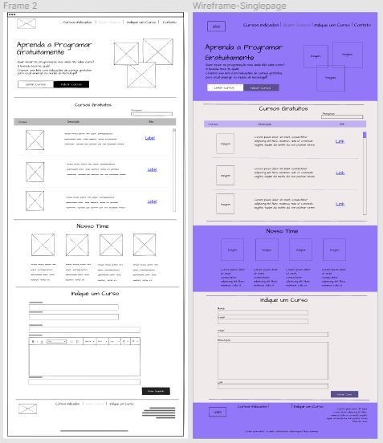

# Projeto Final {Reprograma}
Bussola Tech 2021

<h1 align="center">
    <br>
    <p align="center">Bussola Tech - Back End<p>
</h1>
<p align="center">

</p>
<br>

## 💻 Sobre o projeto 

<br>

<p align="justify">Este projeto consiste em reduzir o deficit educacional e o deficit de diversidade na área de tecnologia gerando acesso a cursos gratuitos na área de TI.  

<p align="justify">Visando como público alvo mulheres em situações de vulnerabilidade social, econômica e de gênero, preferencialmente negras e/ou transgênero.
<p align="justify">A pauta da diversidade na tecnologia só faz sentido dentro de uma visão que abrange a pluralidade das pessoas, uma pesquisa realizada pelo PretaLab em parceria com a Thoughtworks, entre o mês de novembro de 2018 e março de 2019, levantou dados sobre os perfis dos profissionais de tecnologia do Brasil.    
<p align="justify">As mulheres atuam 31,7% dos cargos, e mesmo com o crescimento das mulheres no segmento, ainda existem muitas barreiras para enfrentar e uma dessas barreiras começa pelo início nos estudos no segmento da tecnologia.
<p align="justify">Muitas ações falam em diversidade, mas só contemplam mulheres brancas, cis, heterossexuais.
<p align="justify">A estimativa feita pela Associação Nacional de Travestis e Transexuais (Antra), com base em dados colhidos nas diversas regionais da entidade, aponta que 90% das pessoas trans recorrem a prostituição ao menos em algum momento da vida. 
<p align="justify">A Bússola Tech acredita que iniciando sua carreira e investindo em capacitação na TI, lhe proporcionará mais autonomia, principalmente quando projetos sociais que buscam incluir pessoas vulneráveis dão todo suporte.

<br>
<br>

## 🚀 Descrição da API Bussola Tech

<br>

<p align="justify">Inicialmente o projeto consiste em uma API REST para uma plataforma de cursos gratuitos , onde iniciantes na programação podem achar indicações de
cursos e plataformas gratuitas para estudar e tirar dúvidas.

<p align="justify">A interface é um CRUD completo integrado com o banco de dados, onde é possível fazer cadastros, atualizar os dados e deletar informações de alunos e cursos.

    
 API desenvolvida como Projeto Final para conclusão do curso de Backend  [{Reprograma}](https://reprograma.com.br/)

  
<br>
<br>
    
## 🔗 Fontes 

- [Pesquisa PretaLab](https://www.pretalab.com/dados)
- [#QuemCodaBR](https://assets-global.website-files.com/5b05e2e1bfcfaa4f92e2ac3a/5d671881e1161a6d2b8eb78b_Pesquisa%20QuemCodaBR.pdf)
- [Profissas](https://www.profissas.com.br/diversidade-e-inclusao-na-tecnologia/)
- [Antra](https://antrabrasil.org/)
    
<br>
<br>

## Wireframe

<p align="center">

</p>
<br>
<br>
    
## ⚙️ Funcionalidades

- Listar todas as pessoas e cursos que estão cadastrados no sistema;
- Conseguir visualizar o cadastro de alunos pelo Id;
- Listar cursos pela area ou pelo nome;
- Cadastrar pessoas que estejam em caso de vulnerabilidade social;
- Atualizar informaçẽs de cursos e de alunos;
- Deletar cursos ou cadastro de alunos
    
<br>

<br>

## 🛠️ Tecnologias utilizadas nesse projeto

<br>

Para a construção do projeto, as seguintes tecnologias foram utilizadas:

- [JavaScript](https://www.javascript.com/)
- [Git/Github](https://github.com/)
- [Node.js](https://nodejs.org/en/)
- [MongoDb](https://www.mongodb.com/)
- [MongoCompass](https://www.mongodb.com/pt-br/products/compass)
- [MongoDBatlas](https://www.mongodb.com/cloud/atlas)
- [Postman](https://www.postman.com/)
- [Vscode](https://code.visualstudio.com/)
- [heroku](https://dashboard.heroku.com/apps)  

### Pacotes Utilizados 

- [Express](https://expressjs.com/pt-br/)
- [Nodemon](https://nodemon.io/)
- [dotenv](https://www.npmjs.com/package/dotenv)
- [Mongoose](https://mongoosejs.com/)
- [cors](https://www.npmjs.com/package/cors)


<br>

## 📁 Arquitetura MVC 

```
 📁 BUSSOLATECH-BACKEND
   |
   |-  📁 src
   |    |
   |    |- 📁 controller
   |         |- 📑 coursesController.js
   |         |- 📑 loginUsuarioController.js
   |     
   |
   |    |- 📁 database
   |         |- 📑 mongoConfig.js
   |
   |    |- 📁 models
   |         |- 📑 coursesSchema.js
   |         |- 📑 loginUsuarioSchema.js
   |         
   |    |- 📁 routes
   |         |- 📑 coursesRoutes.js
   |         |- 📑 studentRoutes.js
   |
   |    |- 📑 app.js
   |
   |- 📑 .env
   |- 📑 .env.example
   |- 📑 .gitignore
   |- 📑 package-lock.json
   |- 📑 package.json
   |- 📑 ProcFile
   |- 📑 README.md
   |- 📑 server.js
```
<br>

## 🔃 Rotas

* local: http://localhost:7595

* Heroku: https://bussola-tech.herokuapp.com/

    * Utilize o [Postman](https://www.postman.com/) ou [Insomnia](https://insomnia.rest/download/) para para chamar e testar os endpoints da API localmente ou via Heroku

<br>

## 🔃 Manipulação das Rotas de Alunos:

| Método HTTP  | Endpoint                | Descrição                            |
| ------------ | ----------------------- | ------------------------------------ |
| GET          | `/students/all`                | Retorna todos os usuários            |
| GET          | `/students/search/:id`        | Retorna o usuario referente ao ID solicitado              |
| POST         | `/students/register`         | Cria/cadastra um novo usuário        |
| PUT          | `/students/update/:id`     | Altera informações de um usuário     |
| DELETE       | `/students/delete/:id`     | Deleta um usuário específico         |

<br>

## 🔃 Manipulação das Rotas de cursos:

| Método HTTP  | Endpoint              | Descrição                                  |
| ------------ | --------------------- | ------------------------------------------ |
| GET          | `/courses/all`            | Retorna todos os cursos                 |
| GET          | `/courses/search/:name`  | Retorna o curso pelo nome       |
| GET          | `/courses/search/:stack`  | Retorna cursos de acordo com a stack específica (frontend, backend e fullstack)       |
| POST         | `/courses/newRegister`   | Cadastra um novo curso na plataforma                |
| PUT          | `/courses/update` | Atualização ou Alteração informações dos cursos           |
| DELETE       | `/courses/delete/:id` | xclusão de cursos obsoletos ou fora do ar               |

<br>

## 🚧 Melhorias para o futuro (Em construção)

<br>

*  Criar Login e autenticação.
*  Terminar implementação de código Front-end,utilizando algum framework. Para o usuário ter a interação na tela.
* Criar endpoints e permissões de administradores para plataforma.

Estou aberta a opiniões, caso queiram contribuir com meu projeto.

<br>

## 🥰 Agradecimentos

<p align="justify"> Agradeceço a todas as Mulheres que dedicaram seu tempo e suas energias para compartilhar conhecimento e nos oferecer um aprendizado de qualidade e um agradecimento especial a Hannah Freitas!!! MUITO OBRIGADO POR TUDO!!!! 
<p align="justify">Galera segue os Links dessa Super Deva:

- [Hannah Freitas](https://github.com/HannahFreitas)
- [LinkedIn](https://www.linkedin.com/in/hannahcfreitas/) 
    
